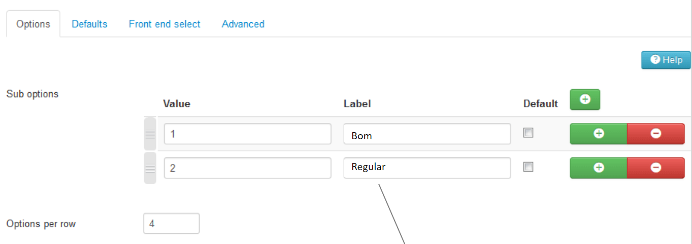
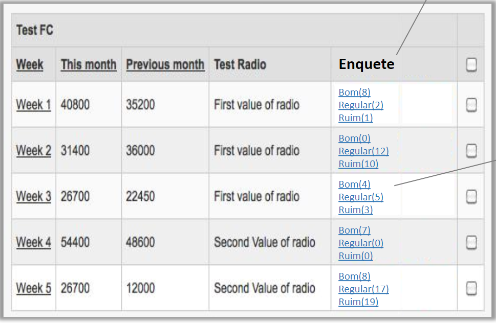

# Fabrik Element Survey

Survey Plugin is an Element plugin, through the use of this plugin it is possible to create a poll element for voting where you can configure several alternatives.

Example: 

<ul>
    <li> 
        Element Stuck with options to vote: Cheap | Dear | Very expensive
    </li>
    <li>
        Quality Element with options to vote: Bad | Regular | Good | Great
    </li>
</ul>

There is currently a similar plugin called "Thumb Plugin" but it only supports two alternatives for voting per item.

[Thumbs Element](http://fabrikar.com/forums/index.php?wiki/thumbs-element/)

## Fabrik Element Survey Specifications

Using this plugin is very simple, just create an element and in the plugin option of the element creation screen select the "Survey" plugin, just below the plugin settings will be loaded: 

  

 

In the settings, specifically in the "Sub Options" section, you must create the options to be voted on. So these options will be available for voting in the listing as exemplified in the image below: 

  

