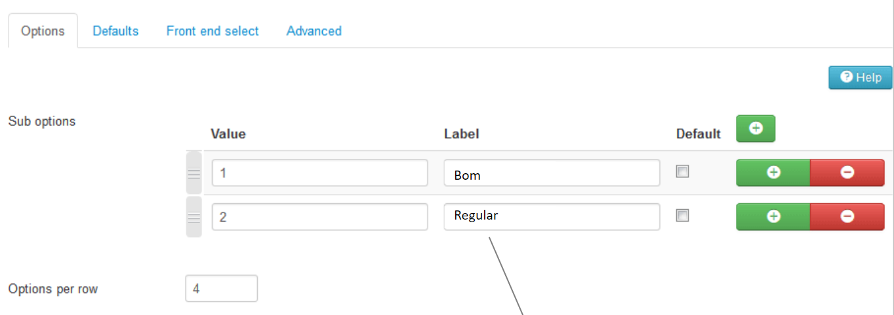
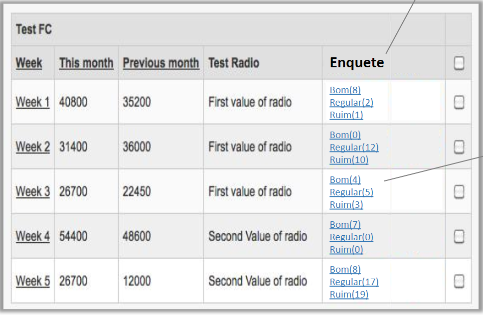

# Fabrik Element Survey

  

## Sobre

O Plugin Survey se trata de um plugin de Elemento, através do uso deste plugin é possível criar um elemento do tipo enquete para votação onde pode-se configurar várias alternativas.

Exemplo: 

<ul>
    <li> 
        Elemento Preço com as opções para votar: Barato | Caro | Carrissimo
    </li>
    <li>
        Elemento Qualidade com as opções para votar: Ruim | Regular | Bom | Excelente
    </li>
</ul>

Atualmente existe um plugin similar chamado "Thumb Plugin" mas o mesmo só suporta duas alternativas para votação por item.

[Thumbs Element](http://fabrikar.com/forums/index.php?wiki/thumbs-element/)

## Especificações do Fabrik Element Survey

O uso deste plugin é demasiadamente simples, basta criar um elemento e na opção plugin da tela de criação do elemento selecionar o plugin "Survey", logo abaixo serão carregadas as configurações do plugin: 

  

 

Nas configurações, especificamente na sessão "Sub Options", deve-se criar as opções a serem votadas. Assim essas opções estarão disponíveis para voto na listagem como exemplificado na imagem abaixo:  

  

